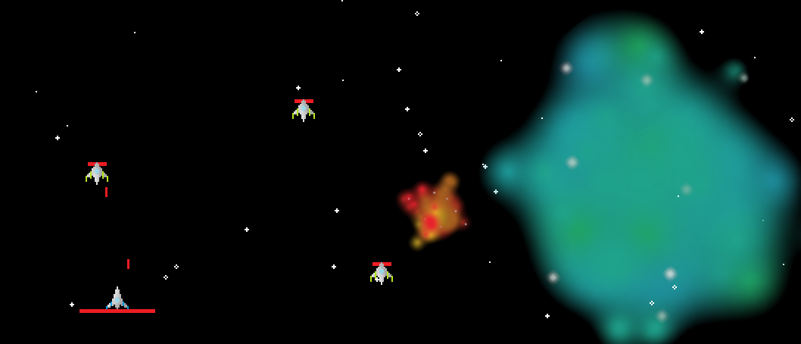

In early 2020, I told myself I had to make a game from scratch using what I learned in my high-school programming classes. So I started watching this Java game development tutorial series on the YouTube channel <i>CodeNMore</i>.

<iframe class="responsive-iframe" src="https://www.youtube.com/embed/videoseries?list=PLah6faXAgguMnTBs3JnEJY0shAc18XYQZ"></iframe>

 
After watching this series, I created my first couple Java games. The first was a side-scrolling platformer in which the player's speed was uncapped and enemies can be killed by landing on them like in <i>Super Mario Bros.</i> <a href="https://github.com/dbwrush/2DPlatformer/releases">You can download that one here.</a> This game also features terrain that is generated as you play, created from a small number of blocks similar to <i>Minecraft</i> or <i>Terraria</i>. Later on I added some power-ups such as speed shoes and a jet pack, plus a backdrop with parallax scrolling to create the illusion of depth.
  
That parallax scrolling technique was re-used on my second game, which I simply titled <i>SpaceShooter</i>, where the player shoots enemy spacecraft against a scrolling background of stars. In this game I experimented with animated sprites and scaling difficulty. This game has a wider roster of enemies, some of which have stronger weapons or armor, others might have the ability to shoot at an angle. You can try <i>SpaceShooter</i> by downloading it from <a href="https://github.com/dbwrush/SpaceShooter/releases">this GitHub repository.</a>
 

